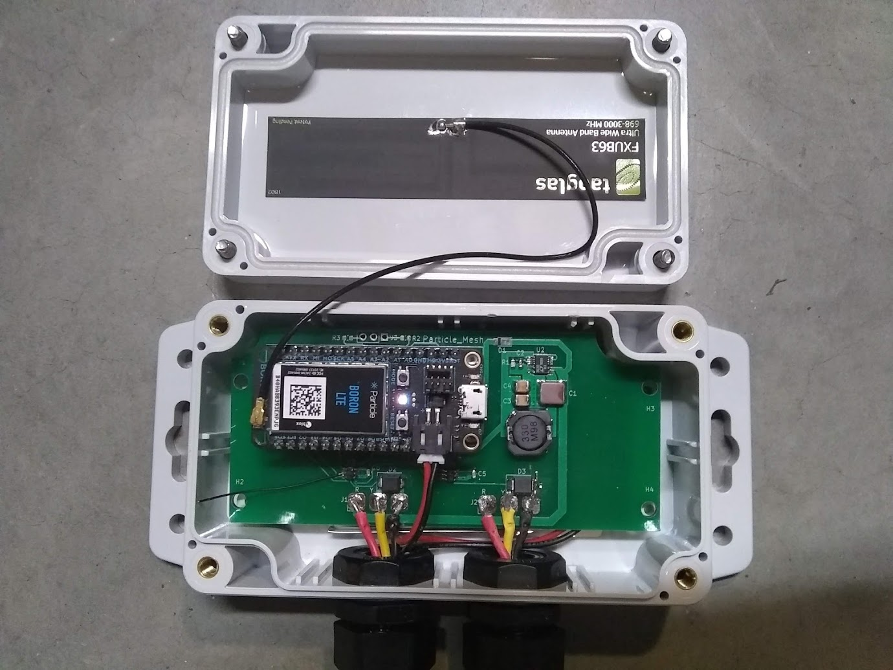
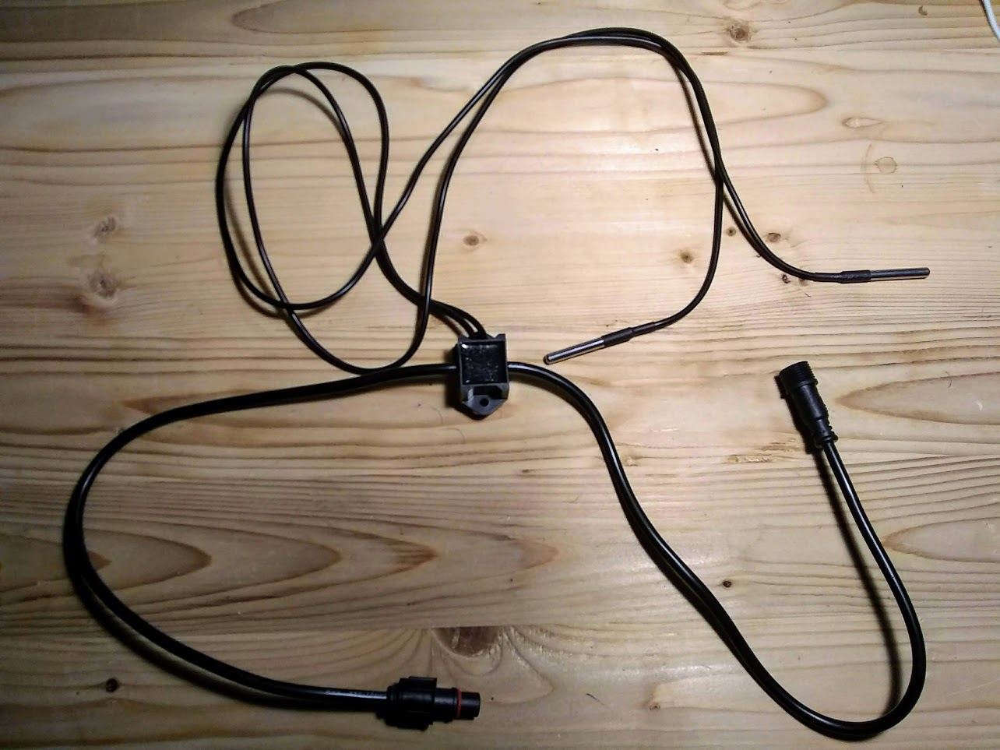
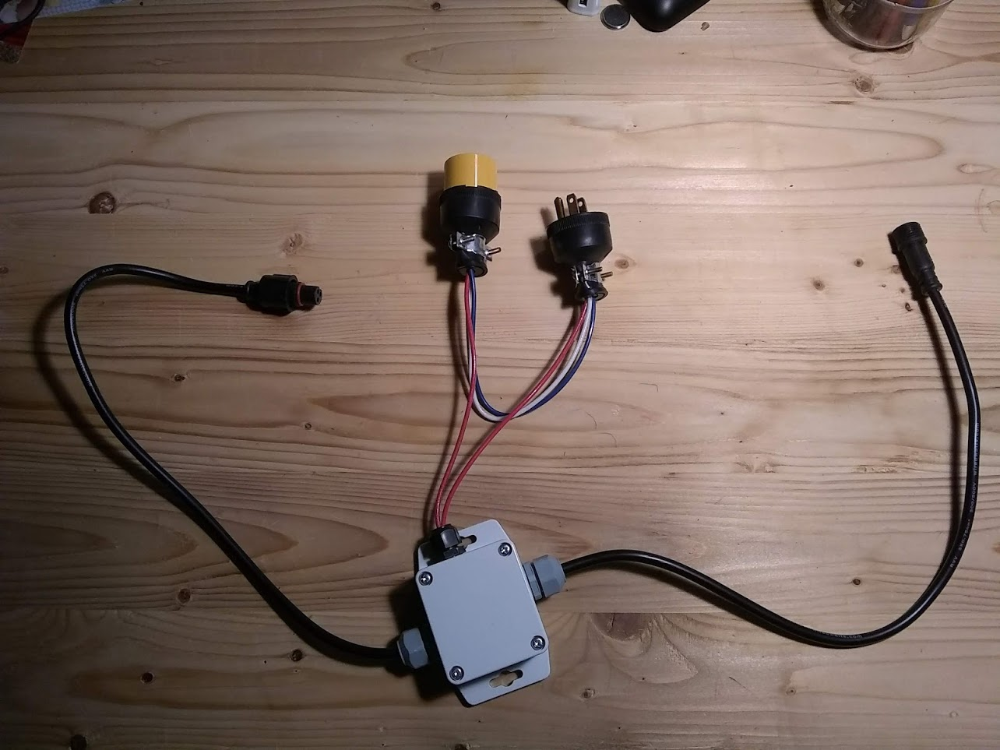

# Simple IoT Hardware

The Simple IoT hardware currently consists of a gateway with a
[Feather](https://learn.adafruit.com/adafruit-feather/) socket that works with
modules from
[Particle](https://store.particle.io/collections/prototyping-hardware) and
[Adafruit](https://www.adafruit.com/feather). Multiple sensor/IO nodes can be
attach to the gateway and daisychained for 10's of feet. The system is
waterproof and uses low cost
[xConnect](https://www.wiredwatts.com/3-core-xconnect-connector) 3-wire
connectors.

## Software

The Simple IoT project also includes open source gateway
[firmware](https://github.com/simpleiot/firmware/tree/master/siot-fw) and
[portal](https://github.com/simpleiot/simpleiot) software.

## Gateway

- [Feather](https://learn.adafruit.com/adafruit-feather/) socket
- Two 3-wire expansion pigtails (power, 1-wire, data)
- Power (5-24VDC) can be attached to either expansion connector
- Sensors can be attached to both expansion connectors
- Waterproof, UV resistant enclosure
- [design files](https://github.com/simpleiot/hardware/tree/master/siot-gateway-particle)

## Temperature node

- two DS18B20 1-wire temperature sensors
- [design files](https://github.com/simpleiot/hardware/tree/master/siot-node-temp)

## AC Current measurement node

- uses [CR9580](https://www.crmagnetics.com/current-sensors/cr9580) current
  sensors
- [design files](https://github.com/simpleiot/hardware/tree/master/siot-node-current-clamp)

## Relay node

- 5A Relay
  ([G6DN-1A-L-DC5](https://www.mouser.com/datasheet/2/307/en-g6dn-838135.pdf)
- [design files](https://github.com/simpleiot/hardware/tree/master/siot-node-relay)

The relay node has a terminal block inside the enclosure. The above example
shows an example of an AC plug switched by the relay. Although the relay is
rated for line level voltages, the PCB design is not UL tested or certified for
line level voltages, so use at your own risk.

## Sensor extension cables

xConnect extension cables can be purchased from
[Wired Watts](https://www.wiredwatts.com/3-core-xconnect-connector)
