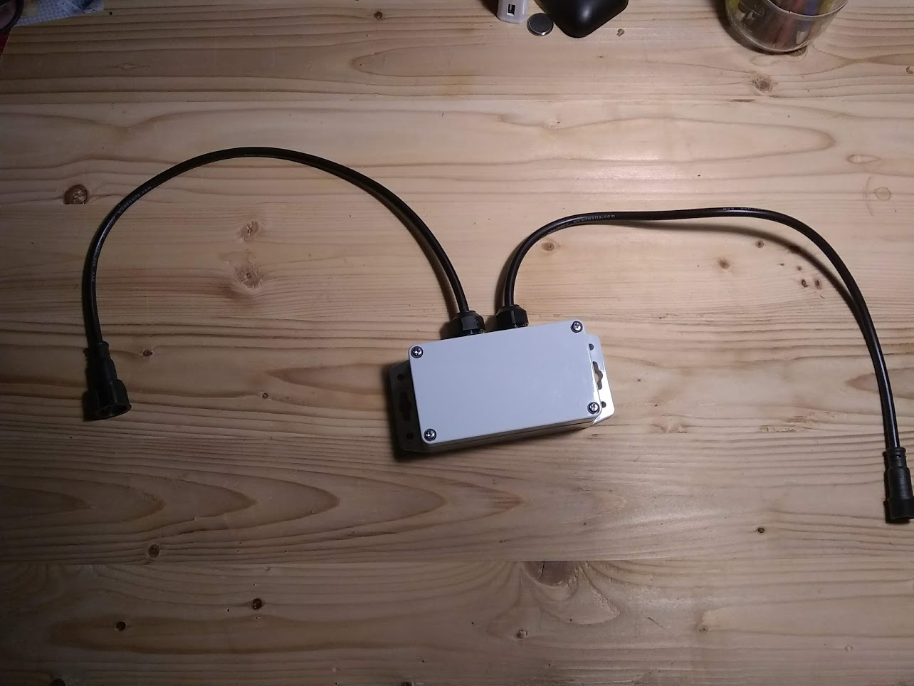
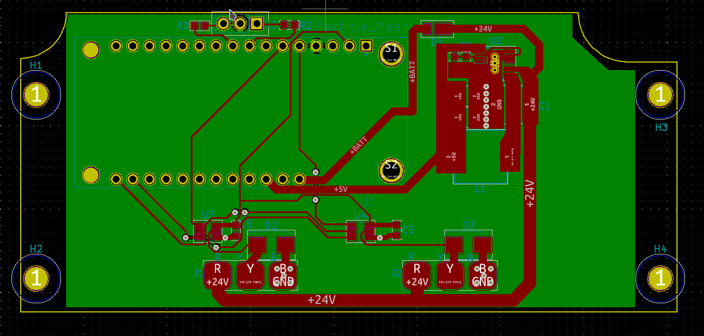

The Simple IoT Gateway has a
[Feather](https://learn.adafruit.com/adafruit-feather/) socket that works with
modules from
[Particle](https://store.particle.io/collections/prototyping-hardware) and
[Adafruit](https://www.adafruit.com/feather). Two xConnect connectors are also
provided to connect to sensors nodes using a 1-wire bus.

## Specifications

- 5-24VDC input power (can be connected to either xConnect connector)
- 1-wire signal level: 5V

## Design files

- [design files](https://github.com/simpleiot/hardware/tree/master/siot-gateway-particle)
- [Schematic](https://github.com/simpleiot/hardware/blob/master/siot-gateway-particle/siot-gateway-particle.pdf)

