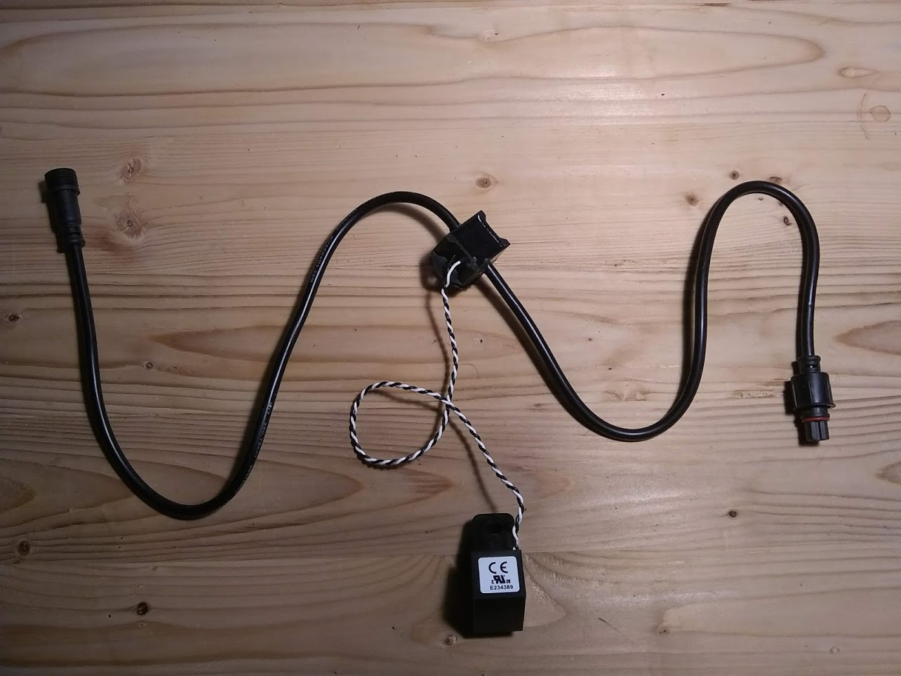
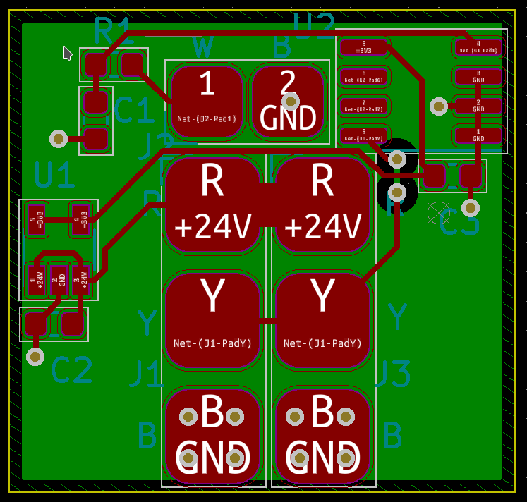

The current node can sense AC current up to 50A.

## Specifications

- input power: 5-24VDC
- 1-wire signal voltage: 5VDC
- current clamp: [CR9580](https://www.crmagnetics.com/current-sensors/cr9580)

## Design files

- [design files](https://github.com/simpleiot/hardware/tree/master/siot-node-current-clamp)
- [Schematic](https://github.com/simpleiot/hardware/blob/master/siot-node-current-clamp/siot-node-current-clamp.pdf)

