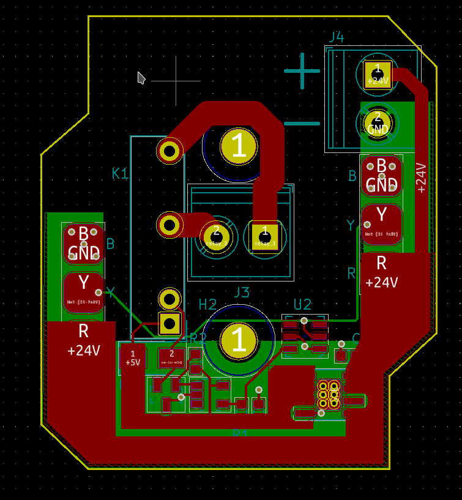

The relay node can be used to switch loads up to 5A.

## Specifications

- input power: 5-24VDC
- relay:
  [G6DN-1A-L-DC5](https://www.mouser.com/datasheet/2/307/en-g6dn-838135.pdf)

## Design files

- [design files](https://github.com/simpleiot/hardware/tree/master/siot-node-relay)
- [Schematic](https://github.com/simpleiot/hardware/blob/master/siot-node-relay/siot-node-relay.pdf)

