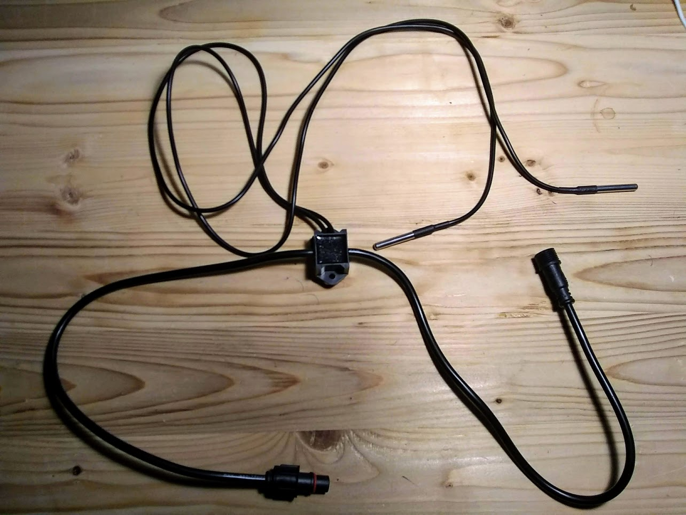

The temperature node has two
[DS18B20](https://www.maximintegrated.com/en/products/sensors/DS18B20.html)
probes.

## Specifications

- input power: 5-24VDC
- 1-wire signal voltage: 5VDC
- sensing range: -55°C to +125°C (-67°F to +257°F)
- accuracy: ±0.5°C from -10°C to +85°C

## Design files

- [design files](https://github.com/simpleiot/hardware/tree/master/siot-node-temp)
- [Schematic](https://github.com/simpleiot/hardware/blob/master/siot-node-temp/siot-node-temp.pdf)

